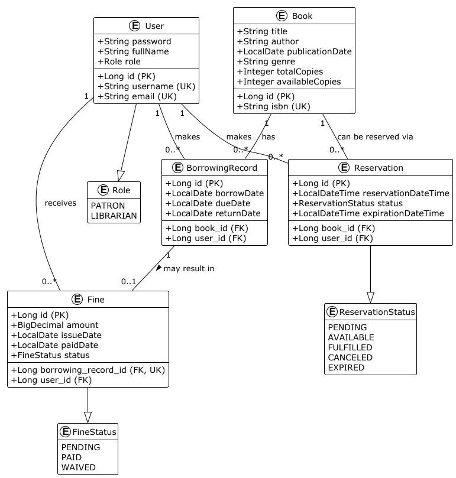

# Library Management System

A comprehensive library management system developed as a final project for Patika.dev & Getir Java Spring Boot Bootcamp. This system provides a complete solution for managing books, users, and borrowing processes in a library environment.

## Features

### Book Management
- Add, update, delete, and search books.
- Detailed book information management (title, author, ISBN, publication date, genre, copy counts).
- Pagination support for book searches.

### User Management
- User registration (Patron or Librarian) and authentication.
- Role-based access control (LIBRARIAN/PATRON).
- User profile management by Librarians.

### Borrowing System
- Book borrowing by Patrons or Librarians (for themselves).
- Book returning by Patrons (for their own borrows) or Librarians (for any borrow).
- Due date tracking.
- Management and listing of overdue books.
- Borrowing history tracking for individual users and all users.

### Reservation System
- Patrons can reserve books that are currently unavailable.
- Librarians can view reservations for specific books and all active reservations.
- Manual trigger for checking and expiring reservations by Librarians.
- Patrons can cancel their own reservations; Librarians can cancel any reservation.

### Fine Management System
- Automatic calculation and generation of fines for late returns.
- Configurable fine amount per day and grace period.
- Fine status tracking (PENDING, PAID, WAIVED).
- Users can view their own fines.
- Librarians can view all fines, fines for specific users, pending fines, and manage fine payments/waivers.

### Reporting System
- Librarians can generate reports on top borrowed books.
- Librarians can generate reports on user activity (total and active borrows).

### Reactive Programming
- Real-time (streamed) book search functionality.
- Reactive endpoint for fetching book details by ID.

### Additional Features
- JWT-based authentication for secure API access.
- Comprehensive API documentation with Swagger/OpenAPI.
- Docker support for easy containerized deployment and testing.

## 🛠 Technology Stack

- **Backend Framework:** Spring Boot 3.3.1
- **Language:** Java 21
- **Database:** PostgreSQL 16
- **Security:** Spring Security with JWT
- **API Documentation:** SpringDoc OpenAPI 3.0 (Swagger UI)
- **Build Tool:** Maven
- **Testing:**
  - JUnit 5
  - Spring Boot Test
  - Mockito
  - H2 Database (for `test` Spring profile, used by `docker-compose` test service)
  - Reactor Test (for reactive endpoint testing)
- **Containerization:** Docker & Docker Compose
- **Reactive Programming:** Spring WebFlux (for specific search endpoints)
- **Code Coverage:** JaCoCo

## 🚀 Getting Started

### Prerequisites
- Java 21 Development Kit (JDK)
- Apache Maven 3.6+
- Docker and Docker Compose (Recommended for easiest setup and deployment)

### Docker Deployment (Recommended)

The project includes a `docker-compose.yml` file for easy setup of the application, PostgreSQL database, and a test execution environment.

1.  **Clone the repository:**
    ```bash
    git clone https://github.com/ozgekrby/library-management-system.git
    cd library-management-system
    ```

2.  **Build and run all services (application and database) using Docker Compose:**
    (Ensure Docker Desktop is running)
    ```bash
    docker-compose up --build -d
    ```
    The `-d` flag runs the containers in detached mode (in the background).

3.  **Access the application:**
    *   Main application: `http://localhost:8080`
    *   Swagger UI for API documentation: `http://localhost:8080/swagger-ui.html`

    The application service (`app`) in `docker-compose.yml` is configured with necessary environment variables to connect to the PostgreSQL service (`db`) also defined in the same file.

### Local Development Setup (Alternative to Docker for the Application)

If you prefer to run the Spring Boot application locally without Docker (e.g., directly from your IDE) but still want to use the Dockerized PostgreSQL:

1.  **Clone the repository** (if not already done).
2.  **Start only the PostgreSQL database using Docker Compose:**
    ```bash
    docker-compose up -d db
    ```
    This will start the PostgreSQL service on port `5432`, and it will be accessible to your locally running application.
3.  **Configure the application:**
    *   Ensure your `src/main/resources/application.properties` file is configured to connect to this PostgreSQL instance. The defaults provided in the "Database Configuration" section should work if the `db` service in `docker-compose.yml` is running.
4.  **Build the project:**
    ```bash
    mvn clean install
    ```
5.  **Run the application (e.g., from your IDE or using Maven):**
    ```bash
    mvn spring-boot:run
    ```

## 📚 API Endpoints & Documentation

Comprehensive API documentation is generated using SpringDoc OpenAPI and is available via Swagger UI when the application is running:

**`http://localhost:8080/swagger-ui.html`**

A Postman Collection is also provided to test the full API flow:

-   **Postman Collection Link:** [Library Management System - Full Flow API](https://documenter.getpostman.com/view/37879624/2sB2qUmPi1)

Below is a summary of the key API endpoints. **For detailed request/response schemas, parameters, and to try them out, please refer to the Swagger UI.**

### Authentication (`/api/auth`)
-   `POST /register`: Register a new user (Patron or Librarian).
-   `POST /login`: Login for existing users to obtain a JWT token.

### Book Management (`/api/books`)
-   `POST /`: Add a new book (LIBRARIAN only).
-   `GET /{id}`: Get book details by ID (Public).
-   `GET /`: Search for books with pagination (Public).
    -   Query Parameters: `title`, `author`, `isbn`, `genre`, `page`, `size`, `sort`.
-   `PUT /{id}`: Update book information (LIBRARIAN only).
-   `DELETE /{id}`: Delete a book (LIBRARIAN only).

### Reactive Book Search (`/api/v1/reactive/books`)
-   `GET /{id}`: Get book details by ID reactively (Public).
-   `GET /search`: Reactively search for books (stream results) (Public).
    -   Query Parameters: `title`, `author`, `isbn`, `genre`.

### User Management (`/api/users`)
-   `GET /{userId}`: Get user details by ID (LIBRARIAN only).
-   `PUT /{userId}`: Update user information (LIBRARIAN only).
-   `DELETE /{userId}`: Delete a user (LIBRARIAN only).
-   `GET /`: Get all users with pagination (LIBRARIAN only).
    -   Query Parameters: `page`, `size`, `sort`.

### Borrowing Management (`/api/borrow`)
-   `POST /`: Borrow a book (Patron for self, or Librarian for self).
-   `PUT /return/{borrowingRecordId}`: Return a borrowed book (Patron for own, Librarian for any).
-   `GET /overdue`: Get all overdue books (LIBRARIAN only).
-   `GET /history/user/{userId}`: Get borrowing history for a specific user (LIBRARIAN only).
-   `GET /history/me`: Get borrowing history for the authenticated user (Patron or Librarian).
-   `GET /history/all`: Get all borrowing history (LIBRARIAN only).

### Reservation Management (`/api/reservations`)
-   `POST /`: Create a new reservation for a book (PATRON only).
-   `POST /expire-check`: Manually trigger check for expired reservations (LIBRARIAN only).
-   `GET /me`: Get active reservations for the authenticated user (PATRON only).
-   `GET /book/{bookId}`: Get all PENDING reservations for a specific book (LIBRARIAN only).
-   `GET /active`: Get all active (PENDING or AVAILABLE) reservations (LIBRARIAN only).
-   `DELETE /{reservationId}`: Cancel a reservation (Patron for own, Librarian for any).

### Fine Management (`/api/fines`)
-   `PUT /{fineId}/waive`: Waive a fine (LIBRARIAN only).
-   `PUT /{fineId}/pay`: Mark a fine as paid (LIBRARIAN only).
-   `GET /user/{userId}`: Get all fines for a specific user (LIBRARIAN only).
-   `GET /pending`: Get all pending fines (LIBRARIAN only).
-   `GET /me`: Get all fines for the authenticated user (Patron or Librarian).
-   `GET /all`: Get all fines in the system (LIBRARIAN only).

### Reports (`/api/reports`)
-   `GET /user-activity`: Get a report of user activity (LIBRARIAN only).
    -   Query Parameters: `page`, `size`, `sort`.
-   `GET /top-borrowed-books`: Get a report of the most borrowed books (LIBRARIAN only).
    -   Query Parameters: `page`, `size`, `sort`.

## 🗄️ Database Schema/Design




## 🔒 Security Configuration

-   JWT-based authentication for securing API endpoints.
-   Role-based authorization (LIBRARIAN/PATRON) to control access to different functionalities.
-   Passwords are encrypted using BCrypt.

Key JWT configuration properties (set via environment variables in `docker-compose.yml` for the `app` service or in `application.properties` for local runs):
```properties
# In application.properties (can be overridden by environment variables)
# jwt.secret=your-very-secure-secret-key-that-is-long-enough
# jwt.expiration.ms=86400000

# In docker-compose.yml (for 'app' service)
# JWT_SECRET=aeeaf880...
# JWT_EXPIRATION_MS=86400000
```
**Important:** The `JWT_SECRET` in `docker-compose.yml` should be treated as sensitive and ideally managed via Docker secrets or a more secure mechanism in production. For local development, ensure it's a strong key.

## 🧪 Testing

The project includes unit, integration, and reactive tests.

-   **Run all tests using Maven locally:**
    ```bash
    mvn test
    ```
    This will use the `test` Spring profile, which is typically configured to use an H2 in-memory database (as seen in your `docker-compose.yml` `test` service environment variables for `SPRING_DATASOURCE_URL`). Ensure your `src/test/resources/application-test.properties` (or similar) reflects this H2 configuration if running tests locally without Docker.

-   **Run tests using Docker Compose:**
    ```bash
    docker-compose run --rm test
    ```
    This command starts the `test` service defined in `docker-compose.yml` (which runs `mvn test`) and removes the container after completion. This service is configured to use an H2 in-memory database for tests.

## 📝 Additional Information

### Key Application Configuration (via Environment Variables in Docker or `application.properties`)
-   `JWT_SECRET` / `jwt.secret`: Secret key for JWT.
-   `JWT_EXPIRATION_MS` / `jwt.expiration.ms`: JWT token expiration time.
-   `LIBRARY_FINE_AMOUNT_PER_DAY` / `library.fine.amount-per-day`: Daily fine amount.
-   `LIBRARY_FINE_GRACE_PERIOD_DAYS` / `library.fine.grace-period-days`: Grace period for fines.
-   `LIBRARY_RESERVATION_HOLD_DURATION_HOURS` / `app.reservation.hold-duration-hours`: Reservation hold duration.
-   `SPRING_MAIN_ALLOW_BEAN_DEFINITION_OVERRIDING=true`: Allows bean overriding, useful when combining MVC and WebFlux security.

### Logging
Configured via environment variables in `docker-compose.yml` for the `app` service (e.g., `LOGGING_LEVEL_ORG_HIBERNATE_SQL=DEBUG`) or can be further customized in `src/main/resources/logback-spring.xml`.

### Code Coverage
JaCoCo is used for code coverage. Reports are generated in `target/site/jacoco/index.html` after running `mvn test`.

## 🤝 Contributing

Contributions are welcome! Please follow these steps:

1.  Fork the repository (`https://github.com/ozgekrby/library-management-system`).
2.  Create your feature branch (`git checkout -b feature/AmazingFeature`).
3.  Commit your changes (`git commit -m 'Add some AmazingFeature'`).
4.  Push to the branch (`git push origin feature/AmazingFeature`).
5.  Open a Pull Request.
